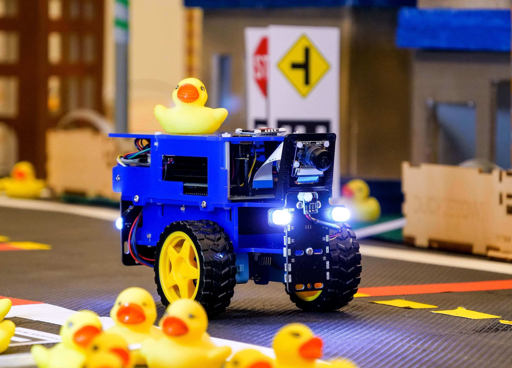

# Atividade 1 - Veículos de Braitenberg

Para a Atividade 1, vamos implementar os veículos de Braitenberg no simulador Duckievillage. O
arquivo `braitenberg.py` atualmente implementa o comportamento agressivo. Nesta tarefa, você deve
implementar o comportamento "lover":

> O veículo de comportamento **lover** deve se aproximar da fonte atratora e manter-se a uma curta
> distância dela sem se chocar-se com ela.

Aqui, vamos assumir que as fontes atratoras são patos.


O robô (simulado) que iremos usar neste curso possue como *input* uma única câmera frontal e dois
motores para cada uma das duas rodas traseiras.



Este tipo de input é mais flexível que o sensor de luz no problema clássico dos veículos de
Braitenberg. Ao invés de detectarmos apenas a luminosidade, podemos também detectar cor ou até
mesmo objetos ou pessoas. Para a Atividade 1, vamos usar cor para detectar os patinhos.

## Filtragem por cor

Para detectarmos os patinhos, precisamos fazer uma filtragem da imagem original em busca de pixels
cuja cor é igual (ou pelo menos parecida) com a dos patos. O notebook `filtro.ipynb` mostra como
construir um filtro de cor.

## Potência dos motores

A partir deste filtro, construímos uma máscara na forma de uma matriz $`M\in\{0,1\}^{m\times n}`$

```math
M_{ij}=\begin{cases}
  1&\text{ se o pixel }(i,j)\text{ é da cor dos patinhos,}\\
  0&\text{ caso contrário;}
\end{cases}
```

onde $`m`$ e $`n`$ definem a largura e altura das imagens recuperadas pela câmera do robô.
Usaremos esta máscara no simulador para detectar a presença de patinhos na câmera frontal do
Duckiebot e reagir conforme. Mais especificamente, vamos definir o comportamento dos robôzinhos a
partir de uma *matriz de ativação*.

Seja $`A\in\mathbb{R}^{m\times n}`$ a matriz de ativação de um certo motor. A potência dada a este
motor $p$ é definida por:

```math
p=c+g\cdot\frac{\sum_{i=1}^n\sum_{j=1}^m A_{ij}\cdot M_{ij}}{z},
```

onde $`c`$ é uma constante para manter o robô sempre se movendo, $`g`$ é uma constante para
controlar a velocidade ou estabilizar os movimentos, e $`z`$ é uma constante de normalização para
que o numerador não cresça demais.

Podemos dividir tanto a máscara quanto as matrizes de ativação para que os motores tenham
comportamentos distintos para regiões distintas da câmera. Uma abordagem simples é definir duas
máscaras como as submatrizes

```math
  M_E=M\left[1,\ldots,\lfloor\frac{n}{2}\rfloor;1,\ldots,m\right]\text{ e}\\
  M_D=M\left[\lfloor\frac{n}{2}\rfloor+1, \ldots,n;1,\ldots,m\right],
```
ou seja, as metades esquerda e direita da imagem original. As matrizes de ativação $`E`$ e $`D`$
dos motores esquerdo e direito (cujas dimensões são as mesmas que $`M_E`$ e $`M_D`$
respectivamente) possibilitam comportamentos diferentes para cada motor.

Note que as matrizes de ativação são equivalentes aos sensores de luz no problema clássico dos
veículos de Braitenberg. De forma parecida, podemos também mudar as conexões dos sensores para
implementar diferentes comportamentos.

## Implementando a tarefa

Sua tarefa nesta atividade é construir o comportamento "lover" em `braitenberg.py` alterando as
matrizes de ativação, conexões com os motores ou implementando decisões a partir da máscara. As
matrizes de ativação estão definidas no construtor da classe `Agent`, enquanto que a conexão com os
motores é feita no método `Agent.send_commands`.
